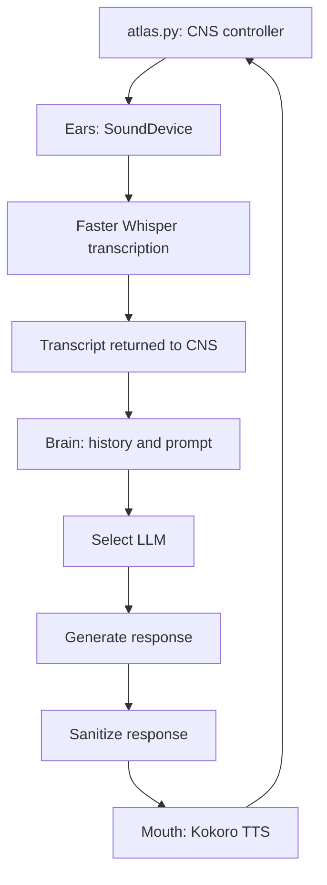

# ATLAS Voice Assistant

ATLAS is a Python voice assistant built around a simple biological metaphor:

- **Ears** capture microphone audio and transcribe speech - STT.
- **Brain** prepares the request, selects an available language model, and processes the response through LangGraph.
- **Mouth** converts the response to speech with Kokoro TTS.

The project is designed for a Windows machine with an NVIDIA GPU, but the language-model layer can fall back to a local Ollama model when cloud connectivity is unavailable.

## Architecture



The central nervous system creates one Brain and one Whisper model for the
session. Ears only listens and returns a transcript; the CNS passes that text
to Brain. Brain includes recent conversation history in the next LLM request,
and Mouth only speaks the response.

### Brain graphs

The brain is composed of three subgraphs:
1. **Input preparation graph**: builds the persona system prompt, recent conversation history, and the user message, then selects the active LLM.
2. **Processing graph**: invokes the selected LLM and extracts its text response.
3. **Speech graph**: sanitizes the response for speech and passes it to the mouth organ.
  
The **Master graph** executes those three subgraphs sequentially.

## Project structure

```text
ATLAS-Voice_Assistant/
├── atlas.py                   # Central nervous system controller and entry point
├── llm.py                     # Online/offline LLM selection and fallback chain
├── pyproject.toml             # Project metadata and dependencies
├── workflow.ipynb             # Notebook that renders graph diagrams as PNGs
├── Behaviour/
│   └── persona.py             # Persona prompt and system-state responses
├── Organs/
│   ├── ears.py                # Microphone capture and speech-to-text
│   ├── brain.py               # LangGraph reasoning pipeline
│   └── mouth.py               # Text-to-speech output
├── Info-organs/               # Explanations of the three organ modules
└── Organs_Showcase/           # Supporting showcase and PDF generation tools
```

## Requirements

- Windows with Python **3.13 or newer**
- A working microphone and audio output device
- NVIDIA GPU and compatible CUDA runtime for the configured Whisper, Kokoro, and PyTorch setup
- `uv` for environment and dependency management
- An Ollama installation if the local fallback model is used
- The `qwen2.5:3b` Ollama model for the offline fallback:

```powershell
ollama pull qwen2.5:3b
```

The configured PyTorch dependency is `torch==2.11.0+cu128`, installed from the CUDA 12.8 PyTorch index declared in `pyproject.toml`.

## Installation

From the project directory, create or synchronize the virtual environment:

```powershell
uv sync
```

Activate it in PowerShell:

```powershell
.\.venv\Scripts\Activate.ps1
```

If PowerShell blocks script execution for the current terminal, use:

```powershell
Set-ExecutionPolicy -Scope Process -ExecutionPolicy RemoteSigned
```

## Configuration

Create a `.env` file in the project root. Cloud keys are optional if Ollama is configured locally.

```dotenv
GEMINI_API_KEY=your_gemini_api_key
GROQ_API_KEY=your_groq_api_key
```

The LLM waterfall is configured in `llm.py` and uses fast failure with an
8-second request timeout and no provider retries:

1. Groq `openai/gpt-oss-120b`
2. Groq `openai/gpt-oss-20b`
3. Gemini `gemini-3.8-flash`
4. Gemini `gemini-3.7-flash`
5. Local Ollama `qwen2.5:3b`

Groq is tried first because both configured models were verified successfully.
Gemini provides an independent cloud fallback, while Ollama is the final local
fallback. Providers without a configured API key are skipped. When the
connectivity probe reports that the machine is offline, Ollama is selected
directly.

The default timeout can be changed with `ATLAS_LLM_TIMEOUT`:

```powershell
$env:ATLAS_LLM_TIMEOUT="8"
```

To enable the local fallback, start Ollama and make sure the model is installed:

```powershell
ollama serve
ollama pull qwen2.5:3b
```

## Running ATLAS

Start the local application interface with:

```powershell
uv run python Application/launcher.py
```

The launcher starts the local FastAPI server, waits for it to become ready, and
opens the Atlas interface in your browser. Keep the launcher terminal open
while using the interface. Click **Start Atlas** to start the voice assistant,
and click **Stop Atlas** to stop it. Press `Ctrl+C` in the launcher terminal to
close the local server.

To run the voice controller directly without the application interface:

```powershell
uv run python atlas.py
```

The application initializes the audio and model components, starts microphone listening, transcribes a spoken prompt, sends the completed prompt to the brain, and speaks the response.

At startup, Atlas speaks one randomized wake response. It then repeats the
following cycle until interrupted:

```text
Listen -> transcribe -> think -> remember -> speak -> listen again
```

Press `Ctrl+C` to request shutdown.

### Current listening behavior

The `ears.py` implementation measures the ambient noise floor, detects speech
using audio energy, and sends speech segments to Faster Whisper after a
0.6-second pause. A session ends after four seconds of silence following
speech. The CNS then sends the returned transcript to the same Brain and starts
the next listening cycle.

The Whisper model is loaded once and reused. Brain keeps the latest 40 messages
in memory, including user requests and Atlas responses. This context is
cleared when Atlas exits; it is not yet persisted across application restarts.

The current implementation does not use a dedicated wake-word detector. Atlas
speaks its wake response at startup and begins listening immediately.

## Viewing the graph flowcharts

Open `workflow.ipynb` in VS Code with the Jupyter extension and run its Python cell. It renders four embedded PNG diagrams:

1. Input preparation and LLM selection  
  
2. LLM processing  
  
3. Sanitization and mouth output  
  
4. Complete master graph  
  

The notebook uses LangGraph's PNG renderer directly. Run the cell in VS Code's notebook editor or Interactive Window to see the rendered diagrams.

## Organ documentation

The `Info-organs` directory contains plain-text explanations of the current organ implementations:

- `Info-organs/ears.txt`
- `Info-organs/brain.txt`
- `Info-organs/mouth.txt`

## Troubleshooting

### Microphone or playback errors

Check that Windows has granted microphone access to Python or VS Code, and confirm that the default input and output devices work with SoundDevice.

### CUDA or model-loading errors

Confirm that the NVIDIA driver, CUDA-compatible PyTorch build, and GPU memory are available. Whisper and Kokoro are configured to use `device="cuda"`.

### Cloud model errors

Verify the relevant API key in `.env`. The waterfall uses Groq first and falls
back to Gemini and then Ollama when a provider is unavailable. Gemini may return
temporary `503` overload or `504` timeout errors; these are handled by the
fallback chain. If all cloud providers fail, make sure Ollama is running and
that `qwen2.5:3b` is installed.

### Kokoro errors

The mouth organ always prints the generated response before attempting speech synthesis. If Kokoro fails, inspect the exception for missing model, audio-device, or CUDA configuration issues.

## Development notes

- The project uses LangGraph `StateGraph` to make the brain pipeline explicit and visualizable.
- The persona is generated dynamically, including a title and demeanor selected for each request.
- The CNS owns the session lifecycle and reuses one Brain and one Whisper model.
- Ears returns transcripts without knowing about Brain conversation history.
- Brain history is bounded to 40 messages to balance context, latency, and token usage.
- Brain responses are sanitized before text-to-speech so Markdown formatting is not spoken aloud.
- Do not commit `.env` or API keys to source control.

## Future improvements

- Add a **GUI** for configuration and status display
- Further **tools in the second graph** for LLM processing or thinking
- Implementation of **RAG (retrieval-augmented generation)** for knowledge retrieval and context-aware responses
- Further **Behavioural files** will be added to update the tonality and the respose format of the assistant
- Persistent conversation memory across Atlas restarts
- Token-aware history trimming or summarization
- A pre-roll audio buffer to preserve the first sounds of a sudden question
- Dedicated wake-word detection and standby mode
- Add a local knowledge base for offline operation
